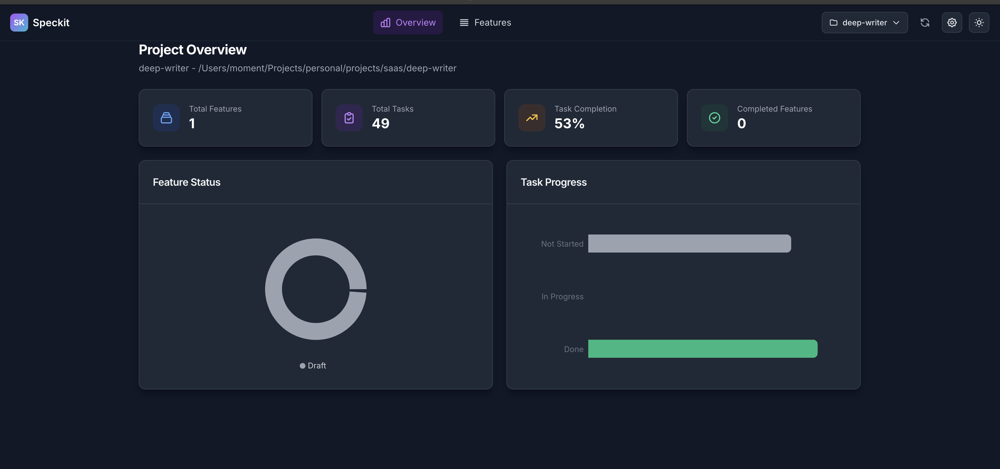
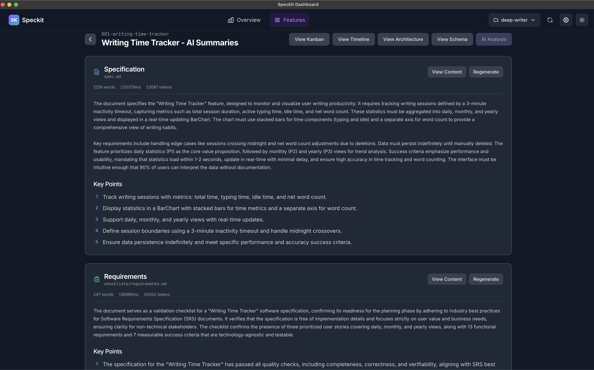
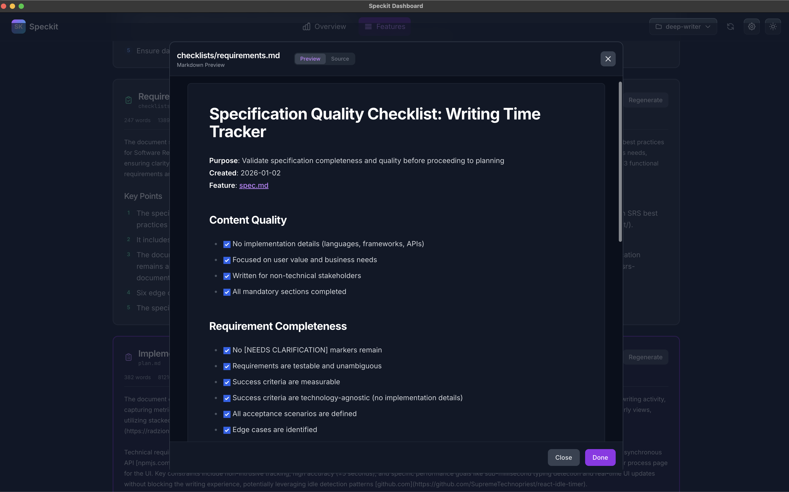
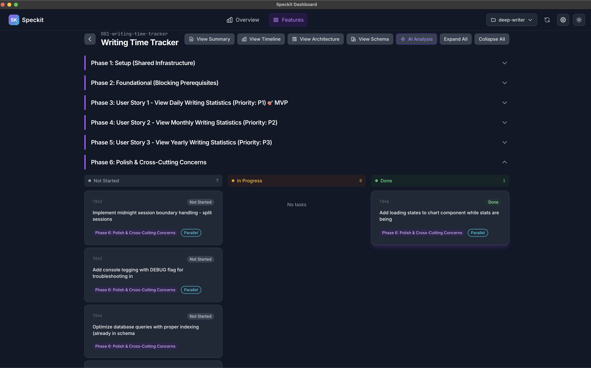
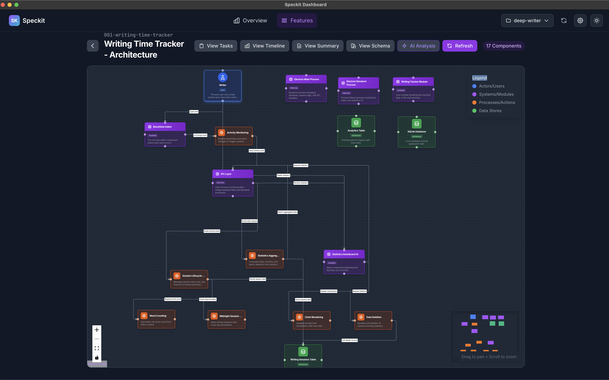
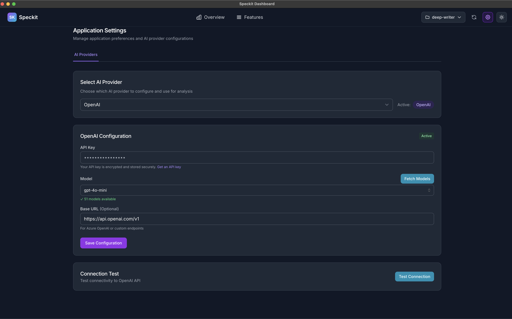

# Speckit Dashboard

> **A modern visualization dashboard for Spec-kit documentation with AI-powered
> analysis**

Speckit Dashboard is an Electron-based desktop application that transforms your
Spec-kit documentation into beautiful, interactive visualizations. Built with
React, TypeScript, and integrated AI capabilities, it provides real-time
insights into your project's features, tasks, architecture, and data models.

[](https://github.com/yourusername/speckit-dash)
[](LICENSE)
[](https://www.electronjs.org/)
[](https://reactjs.org/)

## ✨ Features

### 📊 Project Visualization

- **Stats Overview**: Real-time dashboard with feature progress, task completion
  metrics, and project health indicators
- **Feature List**: Comprehensive view of all features with status tracking and
  metadata
- **Kanban Board**: Drag-and-drop task management organized by phases (Planning,
  Development, Testing, Done)
- **Gantt Timeline**: Project timeline visualization with task dependencies and
  milestones

### 🤖 AI-Powered Analysis

- **Architecture Diagrams**: Auto-generate system architecture visualizations
  from specifications
- **Feature Summaries**: AI-generated summaries of feature specifications
- **Consistency Checks**: Automated validation across spec.md, plan.md, and
  tasks.md
- **Gap Analysis**: Identify missing requirements, unlinked tasks, and
  incomplete documentation

### 🗄️ Data Model Visualization

- **Interactive Schema View**: ReactFlow-powered entity-relationship diagrams
- **Automatic Layout**: Dagre algorithm for clean, organized graph layouts
- **Entity Details**: View attributes, relationships, and validation rules
- **Real-time Updates**: Auto-sync when data-model.md files change

### 🔌 Multiple AI Provider Support

- **OpenAI Integration**: GPT-4, GPT-3.5-turbo, and latest models
- **Ollama Support**: Local AI models for privacy-conscious development
- **OpenRouter**: Access to 100+ AI models through a single API
- **Searchable Model Selection**: Preline-powered dropdown with real-time
  filtering
- **Dynamic Model Loading**: Fetch available models directly from your AI
  provider

### 💾 Data Management

- **SQLite Database**: Fast, persistent storage with WAL mode
- **Soft Delete Projects**: Remove from view while preserving all analysis and
  history
- **Auto-restore Data**: Re-adding a project instantly restores all previous
  work
- **File Watching**: Automatic synchronization when markdown files change

## 📸 Screenshots

### Stats Overview

 _Real-time project dashboard with
feature progress, task completion metrics, and project health indicators_

### Feature Summary

 _AI-generated feature
summaries with comprehensive specification details_

### Markdown View

 _Rich markdown rendering of
specifications with syntax highlighting_

### Kanban Board

 _Drag-and-drop task management
organized by phases with collapsible sections_

### Gantt Timeline

 _Project timeline
visualization with task dependencies and milestones_

### Architecture View

 _AI-generated system
architecture diagrams with interactive components_

### Schema View

 _Interactive entity-relationship
diagrams with automatic layout_

### AI Analysis

 _AI-powered consistency checks,
gap analysis, and quality insights_

### Settings

 _Multi-provider AI configuration with
OpenAI, Ollama, and OpenRouter support__

## 🚀 Getting Started

### Prerequisites

- **Node.js** 20.x or higher
- **npm** or **yarn**
- **Git**

### Installation from Release

Download the latest pre-built version for your platform from the
[GitHub Releases](https://github.com/vhm205/speckit-dash/releases) page:

- **macOS**: Download the `.dmg` file
- **Windows**: Download the `.exe` installer
- **Linux**: Download the `.AppImage` or `.deb` package

> **⚠️ Note for macOS Users**: The app is not signed with an Apple Developer
> certificate yet. If macOS blocks the app, run:
>
> ```bash
> xattr -cr /Applications/Speckit\ Dashboard.app
> ```
>
> Replace the app name with the actual name if different.

### Installation from Source

1. **Clone the repository**
   ```bash
   git clone https://github.com/yourusername/speckit-dash.git
   cd speckit-dash
   ```

2. **Install dependencies**
   ```bash
   npm install
   ```

3. **Rebuild native modules** (for better-sqlite3)
   ```bash
   npm run postinstall
   ```

### Running in Development

```bash
# Start development server with Electron
npm run electron:dev

# For WSL2 users
npm run electron:dev:wsl
```

The application will:

1. Build the Electron main process
2. Start the Vite dev server (http://localhost:5173)
3. Launch the Electron window with hot-reload enabled

### Building for Production

```bash
# Build for all platforms
npm run package

# Platform-specific builds
npm run package:mac     # macOS (.dmg)
npm run package:win     # Windows (.exe)
npm run package:linux   # Linux (.AppImage, .deb)
```

Built applications will be in the `release/` directory.

## 📁 Project Structure

```
speckit-dash/
├── electron/                 # Electron main process
│   ├── main.ts              # Application entry point
│   ├── preload.ts           # Context bridge for IPC
│   ├── services/            # Backend services
│   │   ├── ai-provider.ts   # AI provider management
│   │   ├── analysis-service.ts
│   │   ├── architecture-analyzer.ts
│   │   ├── database.ts      # SQLite operations
│   │   ├── feature-sync.ts  # Markdown parsing & sync
│   │   ├── file-watcher.ts  # File system monitoring
│   │   ├── ipc-handlers.ts  # IPC communication
│   │   └── parser/          # Markdown parsers
│   └── utils/
│       └── db-schema.sql    # Database schema
├── src/                     # React frontend
│   ├── App.tsx             # Main application component
│   ├── components/         # Reusable UI components
│   │   ├── AISettings/     # AI provider configuration
│   │   ├── Navbar.tsx      # Top navigation
│   │   └── ui/             # Design system components
│   ├── contexts/           # React contexts
│   │   ├── AIProviderContext.tsx
│   │   ├── ProjectContext.tsx
│   │   └── ThemeContext.tsx
│   ├── hooks/              # Custom React hooks
│   ├── views/              # Main application views
│   │   ├── AIAnalysis/
│   │   ├── ArchitectureView/
│   │   ├── FeatureList/
│   │   ├── KanbanBoard/
│   │   ├── SchemaView/
│   │   └── StatsOverview/
│   └── types/              # TypeScript type definitions
└── specs/                   # Example Spec-kit documentation
```

## ⚙️ Configuration

### AI Provider Setup

Speckit Dashboard supports multiple AI providers. Configure them in **Settings →
AI Providers**.

#### OpenAI

1. Get your API key from [OpenAI Platform](https://platform.openai.com/api-keys)
2. Save the API key in settings
3. Click "Fetch Models" to load available models
4. Select your preferred model (e.g., gpt-4o, gpt-4-turbo)

#### Ollama (Local AI)

1. Install [Ollama](https://ollama.ai/)
2. Pull models: `ollama pull llama2`
3. Start Ollama: `ollama serve`
4. Configure base URL (default: http://localhost:11434)

#### OpenRouter

1. Get your API key from [OpenRouter](https://openrouter.ai/keys)
2. Save the API key in settings
3. Click "Fetch Models" to load 100+ available models
4. Optionally set Site URL and App Name for analytics

## 🔧 Development

### Available Scripts

```bash
# Development
npm run dev                 # Vite dev server only
npm run electron:dev        # Start Electron with hot-reload
npm run electron:dev:wsl    # WSL2-optimized development

# Building
npm run build              # Build everything
npm run build:electron     # Build Electron main process only

# Quality
npm run test               # Run unit tests (Vitest)
npm run test:watch         # Watch mode
npm run test:coverage      # Coverage report
npm run test:e2e           # E2E tests (Playwright)
npm run lint               # ESLint check
npm run lint:fix           # Auto-fix linting issues
npm run format             # Format with Prettier
npm run type-check         # TypeScript type checking

# Database
npm run db:init            # Initialize database schema
```

### Tech Stack

**Frontend:**

- React 18.2 + TypeScript 5.3
- React Router 6.20 (routing)
- Tailwind CSS 3.4 (styling)
- Preline 2.7 (UI components)
- ReactFlow 11.11 (graph visualization)
- Recharts 2.10 (charts)
- React Markdown (markdown rendering)

**Backend:**

- Electron 28.0
- Better-SQLite3 9.2 (database)
- Chokidar 3.5 (file watching)
- Vercel AI SDK (AI integration)
- Unified/Remark (markdown parsing)

**AI Integration:**

- @ai-sdk/openai 3.0+
- Native Ollama support
- OpenRouter API

**Build Tools:**

- Vite 5.0 (bundler)
- Electron Builder 24.9 (packaging)
- TypeScript 5.3
- ESLint + Prettier

## 🐛 Troubleshooting

### WSL2 Issues

If running on WSL2, use the dedicated script:

```bash
npm run electron:dev:wsl
```

This handles GPU acceleration and display issues. See
`CHANGES/WSL2_ELECTRON_GUIDE.md` for details.

### Database Issues

If the database becomes corrupted:

```bash
# Backup your data
cp ~/.config/speckit-dash/data.db ~/.config/speckit-dash/data.db.backup

# Reinitialize
npm run db:init
```

### Better-SQLite3 Build Errors

After installing dependencies or upgrading Node.js:

```bash
npm run postinstall
```

## 📝 Usage

### Adding a Project

1. Click **"Add New Project"** in the project dropdown
2. Select your Spec-kit project root directory (containing `.specify/` and
   `specs/`)
3. Dashboard will automatically scan and parse all features

### Viewing Features

- **Overview**: Navigate to the home page for project statistics
- **Features List**: Click "Features" in the navbar to see all features
- **Feature Details**: Click any feature card to access:
  - Summary (AI-generated)
  - Kanban Board (tasks by phase)
  - Gantt Timeline (task dependencies)
  - Architecture (system diagram)
  - Schema (data model visualization)
  - AI Analysis (consistency checks, gaps)

### Removing Projects

- Hover over any project in the dropdown
- Click the trash icon on the right
- Confirm removal (data persists in database)
- Re-add anytime to restore all history

## 🤝 Contributing

Contributions are welcome! Please read our [Contributing Guide](CONTRIBUTING.md)
for details.

1. Fork the repository
2. Create your feature branch (`git checkout -b feature/amazing-feature`)
3. Commit your changes (`git commit -m 'Add amazing feature'`)
4. Push to the branch (`git push origin feature/amazing-feature`)
5. Open a Pull Request

## ☕ Support the Project

If you find Speckit Dashboard helpful, consider supporting its development!

[](https://buymeacoffee.com/vhm205)

Your support helps maintain and improve this project. Thank you! 🙏

## 📄 License

This project is licensed under the MIT License - see the [LICENSE](LICENSE) file
for details.

## 🙏 Acknowledgments

- Built with [Electron](https://www.electronjs.org/)
- Powered by [Vercel AI SDK](https://sdk.vercel.ai/)
- Visualizations by [ReactFlow](https://reactflow.dev/)
- UI components from [Preline](https://preline.co/)
- Layout algorithm by [Dagre](https://github.com/dagrejs/dagre)

## 📧 Support

- **Issues**:
  [GitHub Issues](https://github.com/yourusername/speckit-dash/issues)
- **Discussions**:
  [GitHub Discussions](https://github.com/yourusername/speckit-dash/discussions)
- **Documentation**: See the `/specs` directory for detailed feature
  specifications

## ⭐ Star History

<picture>
  <source
    media="(prefers-color-scheme: dark)"
    srcset="
      https://api.star-history.com/svg?repos=vhm205/speckit-dash&type=Date&theme=dark
    "
  />
  <source
    media="(prefers-color-scheme: light)"
    srcset="
      https://api.star-history.com/svg?repos=vhm205/speckit-dash&type=Date
    "
  />
  
</picture>

---

**Made with ❤️ for the Spec-kit community**
